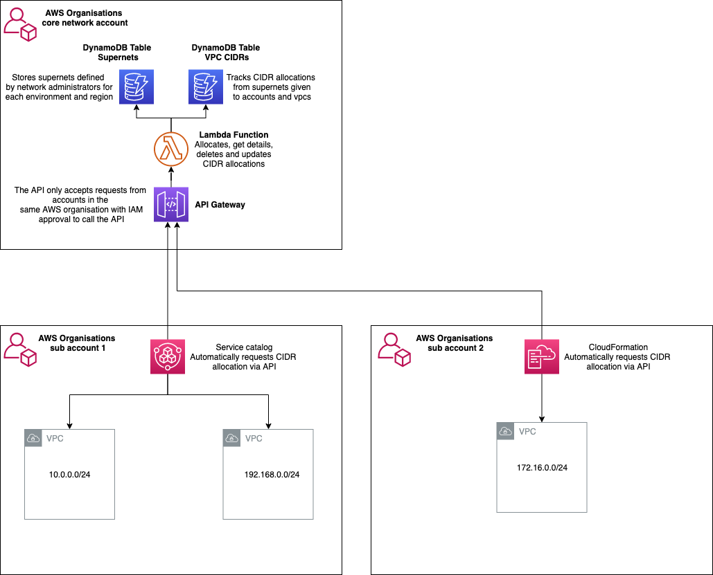

# Overview

The goal of the solution is to empower developers to request VPC's without needing to engage with the network team. To achieve this IP address management is suggested for two reasons.

1. It prevents overlapping IP ranges between VPC's allowing routing between various VPC's and on-premises infrastructure.
2. it allows supernets to be defined based on region and environment enabling organisations to easily summarise routes to reduce the size of route tables and make network management simpler.

This simple application has been created to manage IP addresses across an AWS multi-account environment using AWS Organizations.

The solution deploys a simple API that can request, update, delete and view IP allocations from supernets you define. The records are managed in Dynamo DB.

The solution also provides a CloudFormation template that will request CIDR ranges from supernets you define based on region and environment (e.g. Dev/Stg/Prod). This CloudFormation code can be deployed to AWS Service Catalog to enable self-service for development and infrastructure teams.

The API is protected by IAM authentication and contains a resource policy that restricts access to allow ONLY allow requests from accounts that are part of the AWS Organization.

  

# Deployment

The solution can be deployed into any account within your AWS Organization. Typically this would be your central networking account which is managed by your core network engineers.

1. Either create a new bucket or use an existing bucket in the account and region where you will be deploying the application. This will be used to store the lambda deployment code.

2. Upload the ip-mgmt.zip file to the new or existing bucket.

3. Open the CloudFormation console in the account and region you want to deploy the application

4. Add the additional parameters.

  - S3CodeBucket: the bucket you created or used in steps 1 and 2
  - OrganizationsId: the organisation ID. This can be found by logging into the master AWS account and opening the AWS Organizations console. Click **settings** in the top right corner. This page will display your organizations ID.
  
  - RootOrganizationUnitId: the root OU Id. This can be found by logging into the master AWS account and opening the AWS Organizations console. Click **Organize Accounts**. On the right side of the page you will see the Root OU ARN. You need to take copy the last part of this e.g. *r-4ght*
  

  - your completed parameters should look similar to:
  

5. Leave the rest of the options as defaults and click **Next**. On the next page check **I acknowledge that AWS CloudFormation might create IAM resources.** at the bottom of the page and **Create Stack**.

# Setup

Once the solution is deployed you'll need to configure your first supernet. To do this open the DynamoDB console in the region and account you deployed the solution.

Click on **Tables** in the left corner and select the table **ip-mgmt-supernets**.

Click **Items** and then **Create Item**.

On the *Create Item* form select the **Tree** drop down and choose **Text**. Enter the following JSON customising the region and Cidr range as appropriate.

```
{
  "Cidr": "10.0.0.0/16",
  "Env": "Dev",
  "Region": "eu-west-2"
}
```

Repeat this step for all regions and environments you wish to manage IP addressing for. You can create multiple CIDR ranges per Env and Region. 


## Adding existing subnets

In most cases you will already have existing CIDR address in your environment. If you wish to add these just create an item in the subnets DynamoDB table as follows (editing the values for your setup):

```
{
  "AccountId": 1111111111111,
  "Cidr": "10.0.128.0/24",
  "Env": "Prod",
  "ProjectCode": "InfrastructureServices",
  "Reason": "SharedServices",
  "Region": "eu-west-2",
  "Requestor": "username",
  "VpcId": "vpc-084c08281301eea5d"
}
```

This will reserve the IP range and prevent it being released for another VPC.

# Operations

## Creating VPCs

The first step is to update the **vpc.yml** template with your API endpoint. To do this open the API Gateway console. Click on the API **ip-mgmt-api** and select **stages**, select stage **v0**. Record the **Invoke URL**, e.g. https://ub9kstu5t7.execute-api.eu-west-2.amazonaws.com/v0


Open the **vpc.yml** template and replace the default value for **CidrApiEndpoint** for the value obtained in the previous stage.


Once complete you can use this template to request CIDR ranges automaticaaly during VPC creation. To do this open the CloudFormation console in any account that is a member of the AWS Organization you deployed the application to. Make sure the region you are deploying to is one that you allocated a supernet to in the setup phase.

Create a new stack and choose to upload the vpc.yml template. Complete the parameters:

Environment: this must match one of the environments you created in the setup phase
ProjectCode: optional
Reason: free text field to capture the reason for the request
Requestor: Name of the user requesting the subnet
VpcCidrSize: Size of the VPC subnet e.g. /25, /24, /23 etc


Leave the rest of the options as defaults and click **Next**. On the next page check **I acknowledge that AWS CloudFormation might create IAM resources.** at the bottom of the page and **Create Stack**.

# Enabling backups

As per AWS best practice backups are created in a seperate CloudFromation template. This protects the backups even if the original CloudFormation stack is deleted.

To enable backups of the dyanamoDB tables where your CIDR allocations are stored deploy the stack:

```
enable_backups.yml
```

The default retention is 28 days. This can be changed by amending the **retention** parameter when you deploy the stack.

# Monitoring

Each time a request is made for a CIDR the tool checks how much freespace is available for the Environment and Region being requested. Once 80% of all available address is used for any environment and region combination an alert is sent to the alert email address you supplied when you installed the solution. This gives the network team time to add more CIDR ranges to resolve the issue.

## Amending the template

The VPC template currently only allocates subnets and creates the VPC. you may wish to edit the template to create a set of "standard" VPCs within your organisation.

# AWS Service Catalog

You can use AWS Service Catalog to create a VPC product that can be used by developers and infrastructure engineers to provision VPCs. For more details see 

